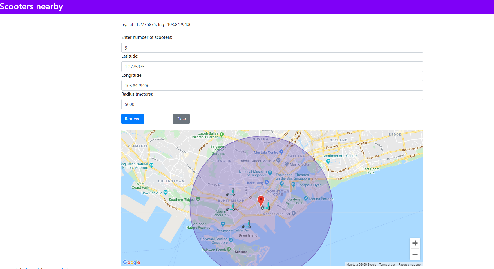

# Scooters Nearby App using Angular 7

# DEMO
>  

## Setup Angular environment and start development server

#### 1. Install AngularCLI globally:
> npm install -g @angular/cli
   
#### 2. Clone project and install node_modules in project directory:
> npm install
  
#### 3. Run application:  
> npm start
  
#### 4. Navigate to `http://localhost:4203/`. The app will automatically reload if you change any of the source files.

## Any problem, suggestions?
   > vipul.zambare1993@gmail.com
